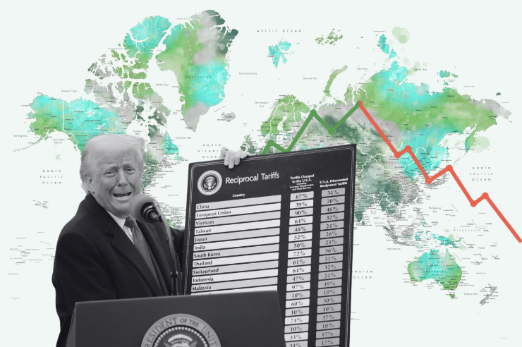

### Diving into data about tariff effects on a top promotional product: T-shirts
#### June 7, 2025
Olivia Borgula
oborgula@terpmail.umd.edu | 616-970-3620

<br>

<p align="center">
  
</p>
<br>
<span style="color: gray;">Trump holding up proposed reciprocal tariffs in April. Graphic by Olivia Borgula.</span>
<br>
<br>

T-shirts are consistently a top promotional product. U.S. President Donald Trump has levied heavy tariffs since taking office in January on top exporters of cotton T-shirts to the U.S. including China, Vietnam and India, resulting in steeper prices and a blow to the industry.  

The Trump administration’s trade war is relevant in the current political climate and has a direct tie to ASI’s coverage because it targets items and generally has led to cost increases. 

ASI has covered tariffs extensively, but the bulk of coverage is breaking news stories or research about stakeholder opinions on tariffs and their general implication for the industry. From what I have seen, there has not been a data-driven story with integrated graphics like the one I’m proposing that analyzes how a promotional product will be affected, like T-shirts.

For this analysis, I used category 340 items with the descriptor "M&B COTTON SHIRTS, NOT KNIT" as specified with <a href="https://www.trade.gov/data-visualization/us-textile-and-apparel-imports-country" target="_blank">data</a> from the International Trade Association. This does not include other cotton aparrel or mixed fabric blend T-shirts that includle cotton. I decided on this item based on research indicating that cotton T-shirts <a href="https://chuxprint.com/blogs/chux-blog/understanding-t-shirt-fabric-options-which-material-is-right-for-you" target="_blank">tend<a/> to be a popular promo item compared to other fabrics. 

<b>Estimated delivery:</b> mid to late June. 

### What the current data shows 

This is the most recent data from the International Trade Administration, but how does it compare to past years? How has it shifted since Trump took office amid heavy tariffs imposed on apparel?

<div class="flourish-embed flourish-map" data-src="visualisation/23601140"><script src="https://public.flourish.studio/resources/embed.js"></script><noscript></noscript></div>

### Examining 2024 data 

<b>Bangladesh, India and Vietnam made up more than 60% of total cotton T-shirt exports in 2024.</b> China and Indonesia followed, at about 9% and 6%, respectively. 

<iframe src='https://flo.uri.sh/story/3154895/embed' title='Interactive or visual content' class='flourish-embed-iframe' frameborder='0' scrolling='no' style='width:100%;height:600px;' sandbox='allow-same-origin allow-forms allow-scripts allow-downloads allow-popups allow-popups-to-escape-sandbox allow-top-navigation-by-user-activation'></iframe><div style='width:100%!;margin-top:4px!important;text-align:right!important;'><a class='flourish-credit' href='https://public.flourish.studio/story/3154895/?utm_source=embed&utm_campaign=story/3154895' target='_top' style='text-decoration:none!important'> </a></div>

### Tariffs have hit the aparrel industry 

<b>Several of the top cotton T-shirt importers have had notable shifts since Trump took office.</b> China's imports have trended down in 2025, Bangladesh's have steadily risen and Honduras and Nicaragua have spiked in 2025. 

This comes after Trump enacted a flurry of tariffs, escalating a trade war with several parts of the world. I chose these countries from the list of top exporters to the U.S. as examples of the tariff impacts, including different continents and regions.  

<iframe src='https://flo.uri.sh/story/3155766/embed' title='Interactive or visual content' class='flourish-embed-iframe' frameborder='0' scrolling='no' style='width:100%;height:600px;' sandbox='allow-same-origin allow-forms allow-scripts allow-downloads allow-popups allow-popups-to-escape-sandbox allow-top-navigation-by-user-activation'></iframe><div style='width:100%!;margin-top:4px!important;text-align:right!important;'><a class='flourish-credit' href='https://public.flourish.studio/story/3155766/?utm_source=embed&utm_campaign=story/3155766' target='_top' style='text-decoration:none!important'> </a></div>

In April, Trump announced a baseline 10% tariff on all imported goods. Top cotton T-shirt exporters were also hit with additional rates in an effort to minimize the U.S.'s trade deficit. Vietnam faces a 46% tariff, Bangladesh is subject to 37% and China has a 34% tariff on top of previously announced duties, raising its tariff rate to 54%. 

Here's the top 10 countries exporting cotton T-shirts to the U.S. in 2024 and their current tariff rates. These rates do not include the base 10% tariff imposed on all countries exporting goods. 

<div class="flourish-embed flourish-table" data-src="visualisation/23636371"><script src="https://public.flourish.studio/resources/embed.js"></script><noscript></noscript></div>

T-shirts have been the most popular promotional product category for years. More than 17% of all promotional product sales in 2024 were in the T-shirt category, according to ASI's research, amounting to over $4.5 billion in sales. 

<iframe src='https://flo.uri.sh/visualisation/23598698/embed' title='Interactive or visual content' class='flourish-embed-iframe' frameborder='0' scrolling='no' style='width:100%;height:500px;' sandbox='allow-same-origin allow-forms allow-scripts allow-downloads allow-popups allow-popups-to-escape-sandbox allow-top-navigation-by-user-activation'></iframe><div style='width:100%!;margin-top:4px!important;text-align:right!important;'><a class='flourish-credit' href='https://public.flourish.studio/visualisation/23598698/?utm_source=embed&utm_campaign=visualisation/23598698' target='_top' style='text-decoration:none!important'> </a></div>

### So what? 
- Trump has levied more tariffs in the first part of his term than any other recent president. This is an unprecedented policy action that has far-reaching consequences, especially on the promotional products industry. 
- Tariffs have already caused changes in the total number of imports from many countries, which will likely cause companies to outsource domestically and to regions with lesser tariffs. 

For this story, my next steps would be to speak with experts to add authority to the findings I'm making. I can assume tariffs will make products more expensive, but I would like someone who studies economics to explain exactly how. Some sources I would talk to would be economic or business experts,  cotton T-shirt manufacturers, and promo product stakeholders who rely on exports from high-tariffed countries.  

Some additional elements I want to include would be walking the reader through an example of how a tariff would increase the price of a common example T-shirt and adding more up-to-date data. For much of this analysis, data is only available until April 2025. But including May and June would provide a more complete picture. 

### Additional questions
1. How do cotton T-shirt imports compare with other apparel items, like polyester shirts? 
2. What's an example of how a tariff on an example brand item would affect a consumer? How much would it raise prices? 
3. Which countries have seen a rise in exports of the material to the U.S. in the first months of 2024

### Data analysis 
```{r message = FALSE, warning = FALSE}
#load in libraries 
library(tidyverse)
library(lubridate)
library(ellmer)
library(httr)
library(jsonlite)
library(rvest)
library(janitor)
library(DT)

# turn off scientific notation
options(scipen = 999)  
```

```{r message = FALSE, warning = FALSE}
# import data for monthly cotton T-shirt imports for all countries between 2020 and 2025
all_countries <- read_csv("../data/all_countries_cotton.csv")%>%clean_names()
```

```{r}
# get data based on ASI's past reports 
#gemini_chat <- chat_google_gemini(model="gemini-2.5-flash-preview-04-17")

#asi_report <- google_upload("../data/x2024_asi_report.png")

#asi_csv <- gemini_chat$chat("Create a CSV where one row is one product in the pie chart, and columns are the values corresponding to each product", asi_report)
```

```{r}
#find quantity & value of exports to US for all countries with at least one export in 2024
quantity_x2024 <- all_countries %>%
  filter(year == 2024) %>%
  group_by(country) %>%
  summarize(
    total_quantity = sum(quantity, na.rm = TRUE),
    total_value = sum(value, na.rm = TRUE),
    .groups = "drop"
  ) %>%
  mutate(
    percent_of_total_quantity = total_quantity / sum(total_quantity) * 100
  ) %>% # find how much each country contributes to the total exports as a percent of the total exports to the US 
  arrange(desc(total_quantity))
```

```{r message = FALSE, warning = FALSE}
# find the top 10 countries exporting cotton T-shirts to the US in March 2025 - the most current data 

quantity_march_x2025 <- all_countries %>%
  filter(year == 2025, month == 3) %>%
  group_by(country) %>%
  summarize(
    total_quantity = sum(quantity, na.rm = TRUE),
    total_value = sum(value, na.rm = TRUE),
    .groups = "drop"
  ) %>%
  arrange(desc(total_quantity)) %>%
  slice_head(n = 10)

datatable(quantity_march_x2025, options = list(pageLength = 10)) 

```

```{r message = FALSE, warning = FALSE}
# find the top 10 countries exporting cotton T-shirts to the US for each year between 2020 and 2025

quantity_x2020_x2025 <- all_countries%>%
  group_by(country, year)%>%
  summarize(yearly_total = sum(quantity, na.rm=TRUE))%>%
  pivot_wider(
    names_from = year,
    values_from = yearly_total,
    names_prefix = "year_"
  )%>%
  select(country, year_2020, year_2021, year_2022, year_2023, year_2024, year_2025)

datatable(quantity_x2020_x2025, options = list(pageLength = 10)) 

# find the top 10 countries exporting cotton T-shirts to the US for each year between 2020 and 2025 by value

value_x2020_x2025 <- all_countries%>%
  group_by(country, year)%>%
  summarize(yearly_total = sum(value, na.rm=TRUE))%>%
  pivot_wider(
    names_from = year,
    values_from = yearly_total,
    names_prefix = "year_"
  )%>%
  select(country, year_2020, year_2021, year_2022, year_2023, year_2024, year_2025)

datatable(value_x2020_x2025, options = list(pageLength = 10)) 
```

### Original pitch
It was originally suggested that I look into Trump's recent cuts on top promotional product industries, including education, healthcare, manufacturing and others. I chose to pitch this idea instead because a key factor in those industries, GDP data, is not available for 2025 until June 26. I also struggled to narrow down that topic and was unsure about whether I could produce meaningful analysis in a week given how many story possibilities there are within that topic. 

But when the data is available, I plan to use it and assess how each industry has performed in 2025 and compare it to the past five to 10 years. I also want to quantity Trump's cuts from the beginning of the year, do some explanatory analysis, and also consider how factors like further cuts in the proposed budget will affect the promotional products industry. 

